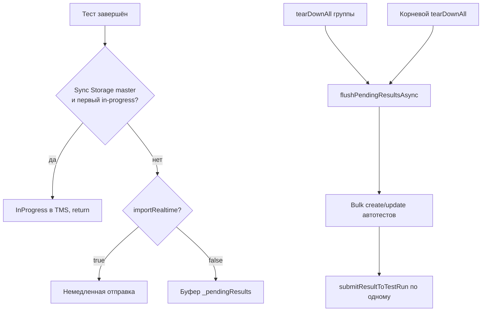

# Практическое использование

Этот документ показывает, как интегрировать адаптер в ваш тестовый набор.

## 1. Интеграция с тестами

Для отправки результатов в Test IT необходимо обернуть ваши существующие тесты в специальные функции-раннеры: `tmsTest` и `tmsTestWidgets`.

### Для обычных тестов (`test`)

Замените стандартную функцию `test` на `tmsTest`.

**До:**
```dart
import 'package:test/test.dart';

void main() {
  test('my_test', () {
    expect(1 + 1, 2);
  });
}
```

**После:**
```dart
import 'package:testit_adapter_flutter/testit_adapter_flutter.dart';

void main() {
  tmsTest('my_test', () {
    expect(1 + 1, 2);
  });
}
```

### Для виджет-тестов (`testWidgets`)

Аналогично, замените `testWidgets` на `tmsTestWidgets`.

**До:**
```dart
import 'package:flutter_test/flutter_test.dart';
import 'package:flutter/material.dart';

void main() {
  testWidgets('MyWidget has a title and message', (WidgetTester tester) async {
    await tester.pumpWidget(const MyWidget(title: 'T', message: 'M'));
    expect(find.text('T'), findsOneWidget);
  });
}
```

**После:**
```dart
import 'package:testit_adapter_flutter/testit_adapter_flutter.dart';
import 'package:flutter/material.dart';

void main() {
  tmsTestWidgets('MyWidget has a title and message', (WidgetTester tester) async {
    await tester.pumpWidget(const MyWidget(title: 'T', message: 'M'));
    expect(find.text('T'), findsOneWidget);
  });
}
```

## 2. Добавление метаданных к тесту

Вы можете обогатить свои тесты дополнительной информацией, которая будет отображаться в Test IT.

### Связывание с тест-кейсами и рабочими элементами

Используйте `externalId` для связи с существующим тест-кейсом в Test IT и `workItemIds` для связи с задачами (например, в Jira).

```dart
tmsTest(
  'Authentication test',
  () { /* ... */ },
  externalId: 'my_project_auth_test_1',
  workItemIds: {'PROJ-123', 'PROJ-456'},
);
```

### Добавление ссылок

Используйте функцию `addLink`, чтобы прикрепить к результату теста произвольные ссылки.

```dart
tmsTest('API response validation', () async {
  // ...
  addLink(
    'https://example.com/api/docs/1',
    title: 'API Documentation',
    description: 'Link to the relevant API docs.',
    type: LinkType.related,
  );
  // ...
});
```

### Добавление вложений

Функция `addAttachment` позволяет прикреплять файлы (например, скриншоты или логи) к результатам теста.

```dart
tmsTestWidgets('Login screen UI test', (WidgetTester tester) async {
  // ...
  await takeScreenshot(tester, 'login_screen.png');
  await addAttachment('login_screen.png');
  // ...
});
```
*Примечание: функция `takeScreenshot` не является частью адаптера и приведена для примера.*

## 3. Структурирование тестов с помощью шагов

Для более детальных отчетов вы можете использовать шаги. `StepManager` позволяет определять и вкладывать шаги друг в друга.

```dart
import 'package:testit_adapter_flutter/testit_adapter_flutter.dart';

void main() {
  tmsTest('User login process', () async {
    await startStep('Enter user credentials', () async {
      await startStep('Enter username', () { /* ... */ });
      await startStep('Enter password', () { /* ... */ });
    });

    await startStep('Click login button', () { /* ... */ });

    await startStep('Verify successful login', () async {
      await startStep('Check for welcome message', () { /* ... */ });
      await startStep('Check user profile icon', () { /* ... */ });
    });
  });
}
```

Функция `startStep` принимает описание и асинхронную функцию, которая будет выполнена в рамках этого шага. Вложенные вызовы `startStep` автоматически создают иерархию шагов.

## 4. Режим batch-проливки (`importRealtime=false`)

По умолчанию (`importRealtime=true`) адаптер ведёт себя как раньше: каждый результат уходит в Test IT сразу после теста.

Batch-режим уменьшает число HTTP-запросов: результаты накапливаются в буфере и отправляются при завершении группы тестов или всего файла. Поведение согласовано с [adapters-python](https://github.com/testit-tms/adapters-python) и [adapters-go](https://github.com/testit-tms/adapters-go).

### Включение

```properties
# testit.properties
importRealtime=false
```

или

```bash
export TMS_IMPORT_REALTIME=false
flutter test
```

### Обязательная инициализация

В начале `main()`:

```dart
void main() {
  tmsConfigureBatchImport();

  group('suite', () {
    group('tms test', () {
      tmsTest('no args - success', () { /* ... */ });
    });
    group('tms testWidgets', () {
      tmsTestWidgets('no args - success', (tester) async { /* ... */ });
    });
  });
}
```

`tmsConfigureBatchImport()` регистрирует корневой `tearDownAll` — финальный сброс буфера в конце файла.

### Жизненный цикл результатов



### Публичные функции

| Функция | Назначение |
| --- | --- |
| `tmsConfigureBatchImport()` | Вызвать в `main()` при `importRealtime=false` |
| `tmsFlushPendingResultsAsync()` | Явный сброс буфера (CI, несколько test-файлов) |

### Важные инварианты

- **Sync Storage:** первый тест на master-воркере всегда проходит через `InProgress`, независимо от `importRealtime`.
- **`externalId`:** логика формирования не меняется; пары `tmsTest` / `tmsTestWidgets` с одним именем по-прежнему делят один `externalId`, но дают два результата в test run.
- **Multi-file:** каждый `*_test.dart` — свой isolate и свой буфер; flush в конце файла. Для прогона всего каталога `flutter test ./test/` при необходимости добавьте явный `tmsFlushPendingResultsAsync()` в пайплайн.

### Пример в репозитории

См. `example/test/arguments_test.dart`, `functions_test.dart`, `steps_test.dart` — в каждом `main()` вызывается `tmsConfigureBatchImport()`. В CI batch-режим проверяется шагом `Test importRealtime false` в `.github/workflows/test.yml`.