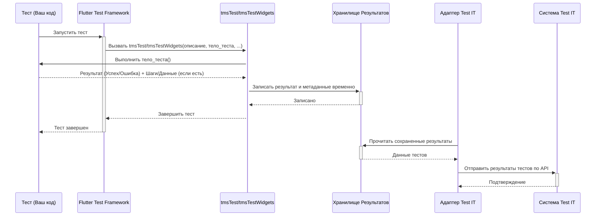

# Chapter 1: Интеграция тестов


Добро пожаловать в руководство по `adapters-flutter`! Эта библиотека — ваш помощник в мире автоматизированного тестирования Flutter-приложений, который позволяет легко соединить ваши тесты с системой управления тестированием (TMS) Test IT.

Представьте, что вы пишете тесты для вашего Flutter-приложения. Вы проверяете логику (юнит-тесты) и внешний вид (виджет-тесты). Все работает отлично на вашем компьютере. Но как сообщить всей команде или вашему менеджеру, что тесты прошли успешно? Как отслеживать историю прогонов? Обычно для этого используют TMS, например, Test IT. Без автоматизации вам пришлось бы вручную заходить в Test IT и отмечать результаты каждого теста. Это долго и чревато ошибками.

`adapters-flutter` решает эту проблему! Он действует как мост между вашими тестами во Flutter и Test IT. Основная идея — использовать специальные функции вместо стандартных `test` и `testWidgets`, которые автоматически отправят результаты в Test IT после выполнения теста.

## Как это работает? Ваши тесты в "обертке" для Test IT

В стандартной разработке на Flutter вы используете функции `test()` для юнит-тестов и `testWidgets()` для виджет-тестов. `adapters-flutter` предлагает их аналоги:

*   `tmsTest()` для юнит-тестов.
*   `tmsTestWidgets()` для виджет-тестов.

Думайте об этих функциях как о специальных "конвертах" или "формах отчетности". Вы пишете свой тест точно так же, как и раньше, но "заворачиваете" его в `tmsTest` или `tmsTestWidgets`. После того как тест отработает (неважно, успешно или с ошибкой), эта "обертка" сама соберет всю нужную информацию (название теста, результат, шаги, если они есть) и отправит ее в Test IT.

### `tmsTest`: Отправка результатов юнит-тестов

Юнит-тесты проверяют небольшие, изолированные части вашего кода (например, одну функцию или метод).

Вот как выглядит обычный юнит-тест во Flutter:

```dart
// Стандартный Flutter тест
import 'package:flutter_test/flutter_test.dart';

void main() {
  test('Простой тест сложения', () {
    expect(1 + 1, 2); // Ожидаем, что 1 + 1 равно 2
  });
}
```

А вот как этот же тест будет выглядеть с использованием `adapters-flutter` для отправки результатов в Test IT:

```dart
// Тест с интеграцией Test IT
import 'package:adapters_flutter/adapters_flutter.dart'; // Импортируем библиотеку

void main() {
  tmsTest('Простой тест сложения (с TMS)', () { // Используем tmsTest вместо test
    expect(1 + 1, 2);
  });
}
```

Видите? Код самого теста остался прежним! Мы просто заменили `test` на `tmsTest` и добавили импорт `adapters_flutter`. Теперь после запуска этого теста результат автоматически отправится в Test IT (если все правильно настроено, о чем мы поговорим в [следующей главе](02_управление_конфигурацией_.md)).

`tmsTest` принимает первым аргументом описание теста (как и обычный `test`), а вторым — само тело теста. У него также есть необязательные именованные параметры, например `externalId` (уникальный идентификатор теста в Test IT) или `title` (заголовок теста), которые помогают связать ваш код с тест-кейсами в TMS. Подробнее об этих параметрах мы поговорим в главе [Функции обогащения результатов](04_функции_обогащения_результатов_.md).

### `tmsTestWidgets`: Отправка результатов виджет-тестов

Виджет-тесты проверяют, как выглядят и работают ваши виджеты (элементы интерфейса).

Стандартный виджет-тест:

```dart
// Стандартный Flutter виджет-тест
import 'package:flutter/material.dart';
import 'package:flutter_test/flutter_test.dart';

void main() {
  testWidgets('Простой виджет-тест текста', (WidgetTester tester) async {
    // Создаем виджет
    await tester.pumpWidget(const MaterialApp(home: Text('Привет!')));
    // Проверяем, что текст "Привет!" есть на экране
    expect(find.text('Привет!'), findsOneWidget);
  });
}
```

Тот же тест с интеграцией Test IT:

```dart
// Виджет-тест с интеграцией Test IT
import 'package:flutter/material.dart';
import 'package:adapters_flutter/adapters_flutter.dart'; // Импортируем библиотеку

void main() {
  tmsTestWidgets('Простой виджет-тест текста (с TMS)', (WidgetTester tester) async { // Используем tmsTestWidgets
    await tester.pumpWidget(const MaterialApp(home: Text('Привет!')));
    expect(find.text('Привет!'), findsOneWidget);
  });
}
```

Опять же, логика теста не изменилась. Мы заменили `testWidgets` на `tmsTestWidgets`. Он так же принимает описание и функцию теста, которая получает объект `WidgetTester` для взаимодействия с виджетами. И точно так же поддерживает необязательные параметры для связи с Test IT.

## Что происходит "под капотом"?

Когда вы запускаете тест с помощью `tmsTest` или `tmsTestWidgets`, происходит несколько шагов:

1.  **Запуск вашего теста:** Библиотека сначала выполняет ваш код теста, точно так же, как это сделал бы стандартный `test` или `testWidgets`.
2.  **Сбор результатов:** Она "ловит" результат выполнения — успешно ли прошел тест (`Passed`), упал с ошибкой (`Failed`) или был пропущен (`Skipped`).
3.  **Сбор метаданных:** Если вы указали дополнительные параметры вроде `externalId`, `title`, `links` и т.д., библиотека собирает и эту информацию. Сюда же добавляются шаги теста, если вы их используете (см. [Управление шагами теста](03_управление_шагами_теста_.md)).
4.  **Формирование отчета:** Все данные упаковываются в специальный формат, понятный для Test IT API.
5.  **Отправка в Test IT:** Сформированный отчет отправляется в вашу систему Test IT через ее API. Для этого адаптеру нужно знать адрес вашего Test IT и токен для доступа — это настраивается в конфигурационном файле (подробнее в главе [Управление конфигурацией](02_управление_конфигурацией_.md)).

Вот упрощенная схема взаимодействия:



### Немного о коде адаптера

Основная логика "оберток" находится в файле `lib/src/manager/test_manager.dart`. Функции `tmsTest` и `tmsTestWidgets` внутри вызывают приватную функцию `_testAsync`.

```dart
// Упрощенный пример из lib/src/manager/test_manager.dart

// Эта функция вызывается и tmsTest, и tmsTestWidgets
Future<void> _testAsync(
    final String description, // Описание теста
    final Future<void> Function() body, // Ваш код теста
    {final String? externalId, // Дополнительные параметры...
     /* ... другие параметры ... */ }) async {

  // 1. Получаем конфигурацию (откуда брать данные для TestIT?)
  final config = await createConfigOnceAsync(); // См. главу 2

  // Проверяем, нужно ли вообще запускать этот тест и отправлять результат
  if (config.testIt ?? true) {
    // ... (проверки и подготовка) ...

    // 2. Создаем пустую запись для результатов этого теста
    await createEmptyTestResultAsync(); // См. главу 5
    final localResult = TestResultModel(); // Модель для хранения данных
    localResult.description = description;
    localResult.externalId = externalId; // Сохраняем метаданные
    // ... (сохранение других метаданных) ...

    final startedOn = DateTime.now(); // Засекаем время начала

    Exception? exception; // Для перехвата ошибок
    StackTrace? stacktrace;

    try {
      // 3. Запускаем ваш код теста
      await body.call();
      localResult.outcome = Outcome.passed; // Если ошибок нет - Успех
    } on Exception catch (e, s) {
      // 4. Ловим ошибку, если она произошла
      localResult.message = e.toString();
      localResult.outcome = Outcome.failed; // Отмечаем как Провал
      localResult.traces = s.toString(); // Сохраняем stack trace
      exception = e;
      stacktrace = s;
    } finally {
      // 5. Записываем время окончания и длительность
      final completedOn = DateTime.now();
      localResult.completedOn = completedOn;
      localResult.duration = completedOn.difference(startedOn).inMilliseconds;

      // 6. Обновляем/сохраняем полный результат теста
      await updateTestResultAsync(localResult); // См. главу 5

      // ... (обработка шагов, teardown и отправка в Test IT API - см. главу 6) ...
    }

    // Если была ошибка, пробрасываем её дальше, чтобы тест "упал" как обычно
    if (exception != null) {
      throw exception;
    }
  } else {
    // Если интеграция отключена, просто запускаем тест
    await body.call();
  }
}
```

Как видите, `_testAsync` выполняет ваш код (`await body.call()`), отслеживает результат в блоке `try...catch...finally`, собирает все данные в модель `TestResultModel` (о ней подробнее в главе [Хранилище и модель результата теста](05_хранилище_и_модель_результата_теста_.md)) и затем инициирует процесс отправки этих данных (которым занимается [Взаимодействие с API Test IT](06_взаимодействие_с_api_test_it_.md)).

## Заключение

В этой главе мы познакомились с основой `adapters-flutter` — функциями `tmsTest` и `tmsTestWidgets`. Мы узнали, что они являются "обертками" для стандартных тестов Flutter, которые позволяют автоматически отправлять результаты выполнения в систему Test IT. Это избавляет от ручного обновления статусов тестов и помогает наладить процесс непрерывной интеграции и отчетности по качеству вашего приложения.

Однако, сами по себе эти функции не знают, *куда* отправлять результаты. Им нужна конфигурация. В следующей главе, [Управление конфигурацией](02_управление_конфигурацией_.md), мы разберемся, как настроить адаптер, указав ему адрес вашего Test IT, токен доступа и другие важные параметры.

---

Generated by [AI Codebase Knowledge Builder](https://github.com/The-Pocket/Tutorial-Codebase-Knowledge)