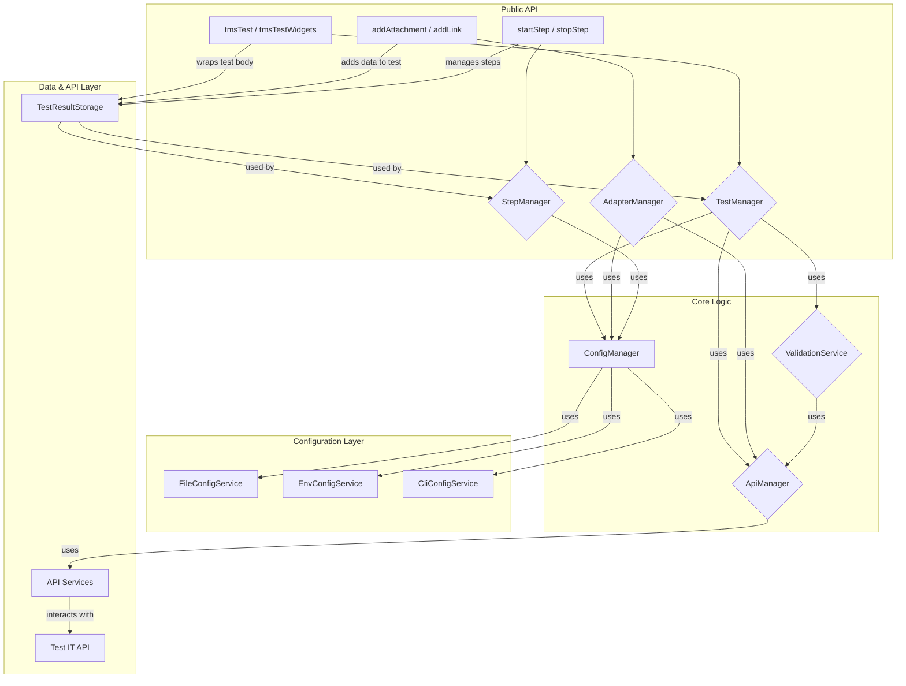

# Архитектура

Адаптер имеет многоуровневую архитектуру, разработанную для четкого разделения ответственности между компонентами.

## Компоненты

### 1. Public API (`manager`'ы)
- **`TestManager` (`test_manager.dart`)**: Предоставляет основные функции (`tmsTest`, `tmsTestWidgets`) для обертывания стандартных тестов Flutter. Он координирует весь процесс: от конфигурации до отправки результатов.
- **`AdapterManager` (`adapter_manager.dart`)**: Содержит функции для добавления метаданных к тестам во время их выполнения, например, вложений (`addAttachment`) и ссылок (`addLink`).
- **`StepManager` (`step_manager.dart`)**: Позволяет определять и структурировать шаги внутри теста, что делает отчеты в Test IT более детальными.

### 2. Core Logic (Основная логика)
- **`ConfigManager` (`config_manager.dart`)**: Отвечает за сбор и объединение конфигурации из различных источников (файлы, переменные окружения, аргументы командной строки).
- **`ApiManager` (`api_manager_.dart`)**: Центральный компонент для взаимодействия с API Test IT. Он инкапсулирует логику для создания и обновления автотестов, отправки результатов и управления тест-ранами. Реализует интерфейс `IApiManager` для обеспечения тестируемости.
- **`ValidationService` (`validation_service.dart`)**: Проводит валидацию конфигурации и данных перед отправкой в Test IT, чтобы предотвратить ошибки на стороне API.

### 3. Configuration Layer (Слой конфигурации)
- **`CliConfigService`**, **`EnvConfigService`**, **`FileConfigService`**: Каждый из этих сервисов отвечает за чтение конфигурации из своего источника: аргументы командной строки, переменные окружения и `testit.json` файл соответственно.

### 4. Data & API Layer (Слой данных и API)
- **`API Services` (`service/api/*.dart`)**: Набор сервисов, каждый из которых отвечает за определенную область API Test IT (например, `AutotestApiService`, `TestRunApiService`).
- **`TestResultStorage` (`storage/test_result_storage.dart`)**: Временное хранилище для данных текущего теста. Используется для накопления информации (вложения, шаги, ссылки) перед отправкой результатов.
- **`Models` (`model/**/*.dart`)**: Определяют структуры данных, используемые в адаптере, как для внутренних нужд, так и для взаимодействия с API.
- **`Converters` (`converter/*.dart`)**: Набор чистых функций для преобразования внутренних моделей данных в модели, ожидаемые API Test IT. 