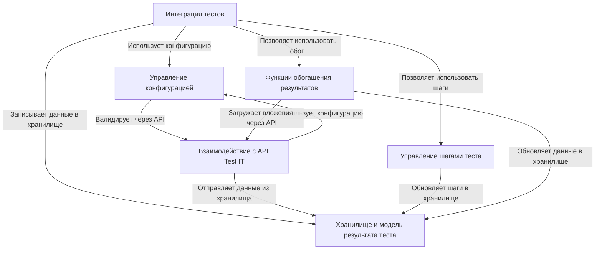

# Tutorial: adapters-flutter

Этот проект, **adapters-flutter**, представляет собой *адаптер*, который позволяет легко интегрировать ваши Flutter-тесты с системой управления тестированием **Test IT**.
Он "оборачивает" стандартные тестовые функции Flutter (`test` и `testWidgets`), позволяя вам указывать *дополнительную информацию* (например, ID теста в Test IT, ссылки, теги).
Во время выполнения теста вы можете делить его на **шаги**, прикреплять *файлы* или *ссылки* и добавлять *сообщения*.
После завершения теста адаптер автоматически собирает всю эту информацию и **отправляет результаты** в ваш экземпляр Test IT для централизованного хранения и анализа.

**Source Repository:** [https://github.com/testit-tms/adapters-flutter](https://github.com/testit-tms/adapters-flutter)

## Chapters

1. [Интеграция тестов
](01_интеграция_тестов_.md)
2. [Управление конфигурацией
](02_управление_конфигурацией_.md)
3. [Управление шагами теста
](03_управление_шагами_теста_.md)
4. [Функции обогащения результатов
](04_функции_обогащения_результатов_.md)
5. [Хранилище и модель результата теста
](05_хранилище_и_модель_результата_теста_.md)
6. [Взаимодействие с API Test IT
](06_взаимодействие_с_api_test_it_.md)

---

Generated by [AI Codebase Knowledge Builder](https://github.com/The-Pocket/Tutorial-Codebase-Knowledge)