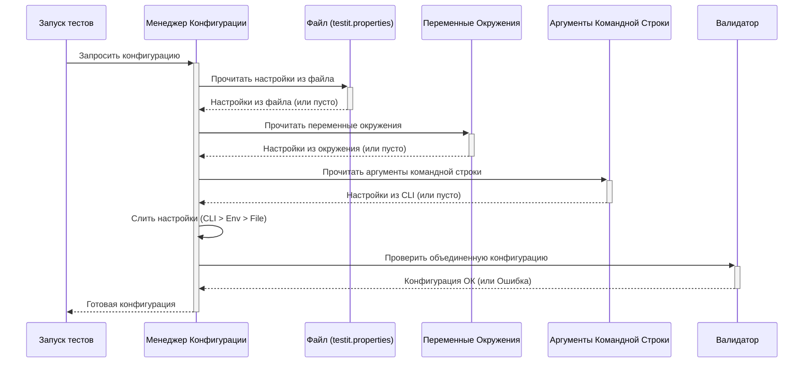

# Chapter 2: Управление конфигурацией


В [предыдущей главе](01_интеграция_тестов_.md) мы узнали, как использовать `tmsTest` и `tmsTestWidgets`, чтобы автоматически отправлять результаты тестов в Test IT. Но остался важный вопрос: как адаптер узнает, *куда* именно отправлять эти результаты? Где находится ваш Test IT? Какой секретный ключ использовать для доступа? Вот здесь на сцену выходит Управление Конфигурацией.

Представьте, что вы отправляете посылку. Вам нужно указать адрес получателя, возможно, какой-то код для входа в здание. Без этой информации почтальон просто не сможет доставить посылку. Точно так же и `adapters-flutter` нуждается в "адресе" и "ключе" для вашего Test IT. Управление конфигурацией — это процесс сбора, проверки и предоставления этой важной информации.

## Зачем нужна конфигурация?

Основная задача — сообщить адаптеру все необходимые параметры для подключения к вашему экземпляру Test IT. Это включает:

*   **Адрес сервера Test IT (URL):** Куда отправлять данные?
*   **Секретный ключ (Private Token):** Как доказать, что у вас есть право отправлять данные? Это как пароль для API.
*   **ID вашего проекта (Project ID):** В какой проект в Test IT загружать результаты?
*   **ID конфигурации (Configuration ID):** Какую конфигурацию тестов использовать в проекте?
*   **ID тест-запуска (Test Run ID):** В какой конкретный запуск тестов добавлять результаты (иногда это нужно указать заранее).

Без этих настроек адаптер будет как водитель без карты — он готов ехать, но не знает куда.

## Откуда адаптер берет настройки? Три источника

`adapters-flutter` может получать настройки из трех разных мест. Это сделано для гибкости: вы можете выбрать способ, который удобнее всего для вашей ситуации.

1.  **Файл `testit.properties`:** Вы можете создать специальный текстовый файл в корне вашего проекта и записать все настройки туда. Это удобно для хранения базовой конфигурации, которая редко меняется.
2.  **Переменные окружения (Environment Variables):** Это переменные, заданные в операционной системе или вашей среде запуска (например, в CI/CD). Они идеально подходят для хранения секретных данных (вроде токена) или для настроек, которые могут меняться в зависимости от окружения (тестовое, продуктивное).
3.  **Аргументы командной строки (Command-line Arguments):** Вы можете передать настройки прямо при запуске тестов командой `flutter test --dart-define=...`. Это удобно для временных изменений или быстрых тестов с другой конфигурацией.

### Приоритет: Кто главный?

А что если одна и та же настройка указана в нескольких местах? Например, адрес сервера Test IT указан и в файле, и в переменных окружения?

Здесь действует простое правило приоритета:

1.  **Аргументы командной строки** (самый высокий приоритет)
2.  **Переменные окружения**
3.  **Файл `testit.properties`** (самый низкий приоритет)

Представьте, что файл — это общая инструкция для всех. Переменные окружения — это уточнение для конкретной ситуации (например, для сборки на сервере). А аргументы командной строки — это как записка "Сделать вот так прямо сейчас!", которая отменяет все предыдущие указания. Адаптер всегда будет использовать значение из источника с наивысшим приоритетом.

## Как настроить адаптер?

Давайте рассмотрим, как задать основные настройки каждым из способов. Нам понадобятся как минимум: `url`, `privateToken`, `projectId`, `configurationId`. Иногда еще `testRunId`.

### Способ 1: Файл `testit.properties`

Создайте файл с именем `testit.properties` в корневой папке вашего Flutter-проекта (там же, где `pubspec.yaml`). Запишите в него настройки в формате `ключ=значение`, каждая на новой строке.

```properties
# testit.properties - Пример конфигурации

# Адрес вашего сервера Test IT
url=https://mytestit.example.com

# Ваш секретный API ключ (Лучше использовать переменные окружения!)
privateToken=SuperSecretToken_PutRealTokenHere

# ID вашего проекта в Test IT
projectId=a1b2c3d4-e5f6-7890-abcd-ef0123456789

# ID конфигурации тестов в проекте
configurationId=f0e9d8c7-b6a5-4321-fedc-ba9876543210

# ID существующего тест-запуска (если adapterMode = 0 или 1)
# testRunId=12345678-90ab-cdef-1234-567890abcdef
```

**Пояснение:**
*   Мы указали адрес нашего Test IT, токен, ID проекта и ID конфигурации.
*   Строки, начинающиеся с `#`, — это комментарии, они игнорируются.
*   `testRunId` закомментирован, так как он нужен не всегда (зависит от режима `adapterMode`, о котором говорится в README).
*   **Важно:** Хранить секретный токен прямо в файле не рекомендуется из соображений безопасности. Лучше использовать переменные окружения.

### Способ 2: Переменные окружения

Вы можете задать те же настройки как переменные окружения. Их имена обычно совпадают с именами в файле, но в верхнем регистре и с префиксом `TMS_`.

Например, в Linux или macOS это можно сделать так в терминале перед запуском тестов:

```bash
export TMS_URL="https://mytestit.example.com"
export TMS_PRIVATE_TOKEN="MySecureTokenFromEnv"
export TMS_PROJECT_ID="a1b2c3d4-e5f6-7890-abcd-ef0123456789"
export TMS_CONFIGURATION_ID="f0e9d8c7-b6a5-4321-fedc-ba9876543210"
# export TMS_TEST_RUN_ID="12345678-90ab-cdef-1234-567890abcdef"

# Теперь запускаем тесты
flutter test
```

**Пояснение:**
*   Команда `export` устанавливает переменную окружения для текущей сессии терминала.
*   Этот способ отлично подходит для CI/CD систем (Jenkins, GitLab CI, GitHub Actions), где секреты и настройки окружения хранятся безопасно.
*   Если `TMS_PRIVATE_TOKEN` задан здесь, он будет использован, даже если `privateToken` есть в файле `testit.properties`.

### Способ 3: Аргументы командной строки

Настройки можно передать непосредственно при запуске тестов с помощью флага `--dart-define`. Имена аргументов такие же, как в файле `testit.properties`, но с префиксом `tms` (в "верблюжьем" стиле, camelCase).

```bash
flutter test \
 --dart-define=tmsUrl=https://another-testit.example.com \
 --dart-define=tmsPrivateToken=TemporaryTestToken \
 --dart-define=tmsProjectId=a1b2c3d4-e5f6-7890-abcd-ef0123456789 \
 --dart-define=tmsConfigurationId=f0e9d8c7-b6a5-4321-fedc-ba9876543210
 # --dart-define=tmsTestRunId=...
```

**Пояснение:**
*   Мы передаем настройки прямо в команде `flutter test`.
*   Обратите внимание на префикс `tms` и стиль `tmsPrivateToken` (не `TMS_PRIVATE_TOKEN` и не `privateToken`).
*   Этот способ имеет наивысший приоритет. Если `tmsUrl` задан здесь, он переопределит значения из переменных окружения и файла `testit.properties`.

### Обязательные и необязательные параметры

Не все параметры из README обязательны для работы. Самые важные, без которых обычно не обойтись:

*   `url`
*   `privateToken`
*   `projectId`
*   `configurationId`

Параметр `testRunId` нужен только если вы используете `adapterMode` равный `0` или `1` (эти режимы добавляют результаты в *существующий* тест-ран). Если `adapterMode` равен `2` (значение по умолчанию), адаптер сам создает новый тест-ран, и `testRunId` указывать не нужно.

Остальные параметры (`isDebug`, `certValidation`, `testRunName` и т.д.) имеют значения по умолчанию или не являются критичными для базовой работы. Полный список и их описание можно найти в файле README проекта (`adapters-flutter`).

## Что происходит "под капотом"? Сборка конфигурации

Когда ваш тест, обернутый в `tmsTest` или `tmsTestWidgets`, запускается впервые, адаптер понимает, что ему нужна конфигурация. Он запускает внутренний механизм, который можно представить так:

1.  **Поиск файла:** Адаптер ищет файл `testit.properties` в корне проекта. Если находит, читает из него настройки.
2.  **Чтение переменных окружения:** Затем он проверяет, заданы ли переменные окружения (типа `TMS_URL`, `TMS_PRIVATE_TOKEN` и т.д.).
3.  **Чтение аргументов командной строки:** После этого он смотрит на аргументы, переданные через `--dart-define` (типа `tmsUrl`, `tmsPrivateToken`).
4.  **Слияние (Merge):** Адаптер берет все найденные настройки и "сливает" их в единый конфигурационный объект. При этом для каждой настройки он использует значение из источника с наивысшим приоритетом (Командная строка > Переменные окружения > Файл > Значение по умолчанию).
5.  **Проверка (Validation):** Прежде чем использовать конфигурацию, адаптер проверяет, что все *обязательные* параметры указаны и имеют корректный формат (например, ID проекта должен быть похож на UUID, URL должен быть действительным адресом). Он может даже попытаться связаться с API Test IT, чтобы убедиться, что токен и ID проекта/конфигурации существуют. Если что-то не так, адаптер выдаст ошибку, и тесты не будут отправлены.
6.  **Предоставление конфигурации:** Готовая и проверенная конфигурация сохраняется и используется для всех последующих шагов, таких как отправка результатов в Test IT (см. [Взаимодействие с API Test IT](06_взаимодействие_с_api_test_it_.md)).

Вот упрощенная схема этого процесса:



### Немного о коде

За этот процесс отвечает `ConfigManager` (файл `lib/src/manager/config_manager.dart`). Ключевая функция — `createConfigOnceAsync`.

```dart
// Упрощенный пример из lib/src/manager/config_manager.dart

final Lock _lock = Lock(); // Замок, чтобы читать конфиг только один раз
ConfigModel? _config; // Здесь будет храниться готовый конфиг

@internal
Future<ConfigModel> createConfigOnceAsync() async {
  // Используем замок, чтобы избежать гонки потоков
  await _lock.synchronized(() async {
    // Если конфиг еще не читали (_config равен null)
    if (_config == null) {
      // Определяем путь к файлу по умолчанию
      final filePath = join(Directory.current.path, 'testit.properties');

      // 1. Читаем конфиг из КАЖДОГО источника
      final fileConfig = await getConfigFromFileAsync(filePath);
      final envConfig = await getConfigFromEnvAsync();
      final cliConfig = await getConfigFromCliAsync();

      // 2. Сливаем конфиги с учетом приоритета
      final mergedConfig = _mergeConfigs(cliConfig, envConfig, fileConfig);

      // 3. Проверяем корректность обязательных полей
      await validateConfigAsync(mergedConfig);

      // 4. Сохраняем готовый конфиг для будущего использования
      _config = mergedConfig;

      // (Тут еще может быть настройка уровня логирования)
    }
  });

  // Возвращаем готовый конфиг
  return _config!;
}

// Функция слияния (упрощенно)
ConfigModel _mergeConfigs(final ConfigModel cliConfig,
    final ConfigModel envConfig, final ConfigModel fileConfig) {
  var config = ConfigModel(); // Начинаем с пустой модели

  // Для каждого параметра выбираем значение: CLI ?? Env ?? File ?? Default
  config.url = cliConfig.url ?? envConfig.url ?? fileConfig.url;
  config.privateToken = cliConfig.privateToken ?? envConfig.privateToken ?? fileConfig.privateToken;
  config.projectId = cliConfig.projectId ?? envConfig.projectId ?? fileConfig.projectId;
  config.configurationId = cliConfig.configurationId ?? envConfig.configurationId ?? fileConfig.configurationId;
  // ... и так далее для всех параметров ...

  // Устанавливаем значения по умолчанию для тех, что не были заданы
  config.adapterMode = config.adapterMode ?? 0; // По умолчанию режим 0
  config.certValidation = config.certValidation ?? true; // По умолчанию валидация включена
  // ...

  return config;
}

// Функция валидации (очень упрощенно)
@internal
Future<void> validateConfigAsync(final ConfigModel? config) async {
  // Проверяем, что основные параметры не пустые и корректные
  if (config?.url == null || config!.url!.isEmpty) {
    throw Exception('Url is required!'); // Выбросить ошибку
  }
  if (config.privateToken == null || config.privateToken!.isEmpty) {
    throw Exception('Private token is required!');
  }
  // ... Проверки для projectId, configurationId, testRunId (если нужен) ...

  // Здесь может быть вызов API для проверки существования проекта/конфига
  // await _validateConfigUsingApiAsync(config); // См. главу 6
}

```

**Пояснение:**
*   `createConfigOnceAsync` вызывается один раз при первом запуске теста с интеграцией.
*   Она последовательно вызывает функции `getConfigFrom...Async` для каждого источника (файлы `file_config_service.dart`, `env_config_service.dart`, `cli_config_service.dart`).
*   `_mergeConfigs` реализует логику приоритетов, используя оператор `??` (null-aware coalescing), который возвращает первое не-null значение слева направо.
*   `validateConfigAsync` (из `validation_service.dart`) выполняет базовые проверки и может обращаться к [Взаимодействие с API Test IT](06_взаимодействие_с_api_test_it_.md) для более глубокой проверки данных.

## Заключение

В этой главе мы разобрались, как настроить `adapters-flutter` для связи с вашим Test IT. Мы узнали, что конфигурация — это набор параметров (адрес, токен, ID проекта и т.д.), необходимых для работы адаптера. Мы рассмотрели три способа задания этих параметров — через файл `testit.properties`, переменные окружения и аргументы командной строки, а также поняли их порядок приоритета. Наконец, мы заглянули "под капот" и увидели, как адаптер собирает и проверяет эту конфигурацию.

Теперь, когда наш адаптер знает, куда и как отправлять результаты, мы можем подумать о том, *что* именно отправлять. В стандартный отчет о прохождении теста можно добавить гораздо больше деталей, например, шаги, которые выполнялись во время теста. Об этом мы поговорим в следующей главе: [Управление шагами теста](03_управление_шагами_теста_.md).

---

Generated by [AI Codebase Knowledge Builder](https://github.com/The-Pocket/Tutorial-Codebase-Knowledge)