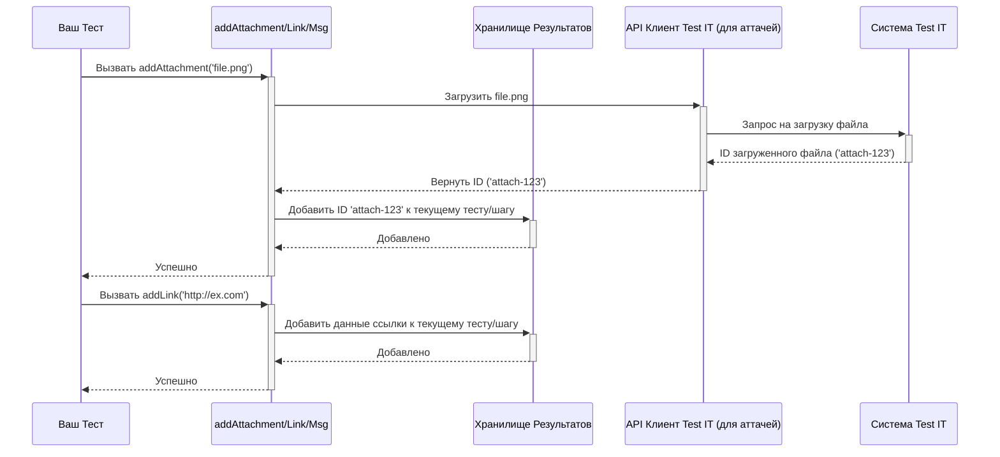

# Chapter 4: Функции обогащения результатов


В [предыдущей главе](03_управление_шагами_теста_.md) мы научились разбивать тесты на шаги с помощью функции `step`, чтобы получать детальные отчеты в Test IT. Это здорово помогает понять, *где именно* в тесте возникла проблема. Но иногда даже этого недостаточно. Что если для анализа упавшего теста вам нужен скриншот экрана в момент ошибки? Или ссылка на связанную задачу в баг-трекере? Или лог-файл с подробной информацией?

Представьте, что вы ведете дневник расследования. Вы записываете не только основные шаги ("Опросил свидетеля А", "Осмотрел место Б"), но и прикрепляете к записям фотографии улик, ссылки на связанные дела или важные цитаты. Это делает ваше расследование гораздо более полным и понятным.

Точно так же **функции обогащения результатов** в `adapters-flutter` позволяют "прикреплять" дополнительную информацию к вашим тестам прямо во время их выполнения. Это делает отчеты в Test IT намного богаче и информативнее, помогая быстрее разбираться в причинах проблем.

## Знакомство с "помощниками": `addAttachment`, `addLink`, `addMessage`

Библиотека предоставляет три основные функции для добавления контекста:

1.  **`addAttachment(String filePath)`:** Позволяет прикрепить файл к результату теста. Чаще всего используется для добавления скриншотов, лог-файлов или других артефактов, которые могут помочь в анализе.
2.  **`addLink(String url, {String? title, String? description, LinkType? type})`:** Позволяет добавить веб-ссылку. Это может быть ссылка на задачу в баг-трекере, документацию, спецификацию или любой другой полезный веб-ресурс.
3.  **`addMessage(String message)`:** Позволяет добавить простое текстовое сообщение к результату теста. Удобно для записи каких-то динамических значений, коротких пояснений или временных логов прямо в отчет.

Эти функции можно вызывать в любом месте внутри тела вашего теста (`tmsTest` или `tmsTestWidgets`) или внутри шага (`step`).

## Прикрепляем файлы с `addAttachment`

Самый частый сценарий — прикрепить скриншот, особенно если тест связан с пользовательским интерфейсом и упал на какой-то визуальной проверке.

Предположим, у вас есть функция `takeScreenshot()`, которая сохраняет снимок экрана в файл. Вы можете добавить вызов `addAttachment` в блок `catch` или `tearDown`, чтобы прикрепить этот скриншот, если тест не прошел.

```dart
import 'package:adapters_flutter/adapters_flutter.dart';
// Предположим, есть функция для создания скриншота
Future<String> takeScreenshot(String name) async {
  // ... логика создания скриншота ...
  print('Создан скриншот: $name');
  return 'path/to/screenshots/$name'; // Возвращает путь к файлу
}

void main() {
  tmsTestWidgets('Тест отображения кнопки "Войти"', (tester) async {
    await tester.pumpWidget(/* ... ваш виджет ... */);

    try {
      // Проверяем, что кнопка видна
      expect(find.text('Войти'), findsOneWidget);

      // ... другие проверки ...

      await step('Проверить цвет кнопки', () {
         // Допустим, эта проверка падает
         expect(getColorOfWidget(find.text('Войти')), Colors.blue); // Упадет!
      });

    } catch (e) {
      // Если произошла ошибка, делаем скриншот и прикрепляем его
      final screenshotPath = await takeScreenshot('login_button_error.png');
      await addAttachment(screenshotPath); // Прикрепляем файл
      print('Скриншот ошибки прикреплен: $screenshotPath');
      rethrow; // Перевыбрасываем ошибку, чтобы тест был помечен как упавший
    }
  });
}
```

**Пояснение:**
*   Мы вызываем `await addAttachment(screenshotPath)` внутри блока `catch`. `await` используется, так как функция асинхронная.
*   `screenshotPath` — это строка, содержащая путь к файлу скриншота, который мы хотим прикрепить. Адаптер найдет этот файл и загрузит его в Test IT, связав с результатами этого теста.
*   Если вам нужно прикрепить сразу несколько файлов, есть функция `addAttachments(Set<String> filePaths)`.

```dart
// Пример прикрепления нескольких файлов
await addAttachments({
  'path/to/log.txt',
  'path/to/screenshot.png'
});
```

## Добавляем ссылки с `addLink`

Часто бывает полезно связать результат автоматического теста с задачей в системе управления проектами или баг-трекере (например, Jira, YouTrack).

```dart
import 'package:adapters_flutter/adapters_flutter.dart';

void main() {
  tmsTest('Тест регрессии для бага #PROJECT-123', () async {
    // Добавляем ссылку на задачу в баг-трекере
    await addLink(
      'https://jira.example.com/browse/PROJECT-123',
      title: 'Баг: Неправильный расчет скидки',
      description: 'Ссылка на исходную задачу в Jira',
      type: LinkType.issue // Указываем тип ссылки (опционально)
    );

    print('Ссылка на баг PROJECT-123 добавлена к тесту.');

    // ... основной код теста ...
    expect(calculateDiscount(100, 10), 90);
  });
}
```

**Пояснение:**
*   Мы вызываем `await addLink()` с URL в качестве первого аргумента.
*   Дополнительные параметры `title`, `description` и `type` (из `LinkType` enum: `bug`, `issue`, `requirement` и т.д.) необязательны, но помогают лучше понять назначение ссылки в Test IT.
*   Как и с аттачментами, есть функция для добавления нескольких ссылок сразу: `addLinks(Set<Link> links)`. Вам нужно будет создать объекты `Link` для этого.

```dart
// Пример добавления нескольких ссылок
await addLinks({
  Link('https://jira.example.com/browse/PROJECT-123', title: 'Баг'),
  Link('https://docs.example.com/discount_rules', title: 'Документация')
});
```

## Оставляем сообщения с `addMessage`

Иногда нужно добавить в отчет не файл или ссылку, а простое текстовое сообщение. Например, значение какой-то важной переменной в момент выполнения или короткое пояснение.

```dart
import 'package:adapters_flutter/adapters_flutter.dart';

void main() {
  tmsTest('Тест с динамическим сообщением', () async {
    final userId = 'user-${DateTime.now().millisecondsSinceEpoch}'; // Генерируем ID
    print('Сгенерирован ID пользователя: $userId');

    // Добавляем ID пользователя в отчет
    await addMessage('Тест запущен для пользователя с ID: $userId');

    await step('Шаг 1: Проверка данных пользователя $userId', () {
      // ... код шага ...
      expect(true, isTrue);
    });
  });
}
```

**Пояснение:**
*   `await addMessage(...)` добавляет переданную строку в отчет текущего теста.
*   Это может быть полезно для отладки или для того, чтобы сделать отчет более понятным, добавив в него контекст времени выполнения.

## Где использовать функции обогащения?

Вы можете вызывать `addAttachment`, `addLink` и `addMessage` практически в любом месте вашего теста:
*   В основном теле `tmsTest` / `tmsTestWidgets`.
*   Внутри шагов `step`.
*   В функциях `setUp`, `setUpAll`, `tearDown`, `tearDownAll` (если они обернуты в `step`, как показано в [предыдущей главе](03_управление_шагами_теста_.md)).
*   В блоках `try...catch` для добавления контекста при ошибках.

Вот пример, где обогащение используется внутри шага:

```dart
import 'package:adapters_flutter/adapters_flutter.dart';

void main() {
  tmsTest('Тест с обогащением внутри шага', () async {
    await step('Шаг с аттачментом и сообщением', () async {
      final resultData = 'Some important data generated here';
      await addMessage('Сгенерированы данные: $resultData');

      // Предположим, мы генерируем какой-то отчет в файл
      final reportPath = 'path/to/step_report.txt';
      // ... (код сохранения отчета в файл) ...
      await addAttachment(reportPath);

      print('Шаг выполнен, отчет и сообщение добавлены.');
      expect(resultData, isNotEmpty);
    });
  });
}
```

Если функция обогащения вызывается внутри `step`, то аттачмент, ссылка или сообщение будут привязаны именно к этому шагу в Test IT. Если вне `step` (но внутри `tmsTest`), они будут привязаны ко всему тесту в целом.

## Как это выглядит в Test IT?

Когда вы откроете результат вашего теста в интерфейсе Test IT, вы увидите добавленную информацию:
*   **Сообщения:** Обычно отображаются как текстовые заметки рядом с результатом теста или шага.
*   **Ссылки:** Показываются как кликабельные ссылки с заголовком, описанием и типом (если были указаны).
*   **Вложения (Attachments):** Отображаются как список прикрепленных файлов, которые можно скачать.

Это значительно обогащает отчет и помогает коллегам (или вам в будущем) быстрее понять контекст выполнения теста и причины возможных сбоев.

## Что происходит "под капотом"?

Когда вы вызываете одну из функций обогащения (`addAttachment`, `addLink`, `addMessage`), адаптер выполняет примерно следующие действия:

1.  **Определение контекста:** Адаптер определяет, к чему привязать информацию — ко всему тесту или к конкретному шагу, который выполняется в данный момент. Он находит соответствующую запись во временном [Хранилище и модели результата теста](05_хранилище_и_модель_результата_теста_.md).
2.  **Обработка данных:**
    *   **`addMessage`:** Текст сообщения просто добавляется к списку сообщений в найденной записи хранилища.
    *   **`addLink`:** Данные ссылки (URL, title, description, type) упаковываются и добавляются к списку ссылок в хранилище.
    *   **`addAttachment`:** Этот случай немного сложнее.
        *   Адаптер находит файл по указанному пути.
        *   Он использует [Взаимодействие с API Test IT](06_взаимодействие_с_api_test_it_.md), чтобы *загрузить* этот файл на сервер Test IT.
        *   Test IT возвращает уникальный идентификатор (ID) для загруженного файла.
        *   Именно этот ID (а не сам файл) добавляется к списку вложений в хранилище.
3.  **Сохранение:** Обновленная информация (с новым сообщением, ссылкой или ID вложения) сохраняется во временном хранилище.
4.  **Отправка:** Позже, когда тест завершится, вся накопленная информация (включая шаги, сообщения, ссылки и ID вложений) будет отправлена в Test IT как единый результат теста.

Упрощенная схема взаимодействия для `addAttachment` и `addLink`/`addMessage`:



### Немного о коде

Логика этих функций находится в файле `lib/src/manager/adapter_manager.dart`. Они, в свою очередь, используют функции из `lib/src/storage/test_result_storage.dart` для обновления данных во временном хранилище.

```dart
// Упрощенный пример из lib/src/manager/adapter_manager.dart

/// Создает вложение через API из [filePath], затем добавляет его к шагу или тесту.
Future<void> addAttachment(final String filePath) async {
  final config = await createConfigOnceAsync(); // Получаем конфигурацию (Глава 2)

  if (config.testIt ?? true) { // Проверяем, включена ли интеграция
    var file = File(filePath).absolute; // Получаем объект файла

    // (Здесь идет проверка существования файла...)
    if (await file.exists()) {
      // 1. Вызываем API для загрузки файла и получения его ID
      final attachment = await tryCreateAttachmentAsync(config, file); // (См. Главу 6)
      // 2. Преобразуем ответ API в модель для хранения
      final modelToStore = toAttachmentPutModel(attachment); // Преобразование
      // 3. Добавляем модель (содержащую ID) в хранилище текущего теста/шага
      await updateTestResultAttachmentsAsync(modelToStore); // (См. Главу 5)
    } else {
      // Логирование, если файл не найден
    }
  }
}

/// Создает ссылку из [url] и др. параметров, затем добавляет ее к тесту.
Future<void> addLink(final String url,
    {final String? description,
    final String? title,
    final LinkType? type}) async {
  final config = await createConfigOnceAsync();

  if (config.testIt ?? true) {
    // 1. Создаем объект Link с переданными данными
    final link = Link(url, description: description, title: title, type: type);
    // 2. Добавляем объект Link в хранилище текущего теста/шага
    await updateTestResultLinksAsync({link}); // (См. Главу 5)
  }
}

/// Добавляет [message] к тесту.
Future<void> addMessage(final String message) async {
  final config = await createConfigOnceAsync();

  if (config.testIt ?? true) {
    // 1. Просто добавляем строку сообщения в хранилище текущего теста/шага
    await updateTestResultMessageAsync(message); // (См. Главу 5)
  }
}
```

**Пояснение:**
*   Каждая функция сначала проверяет конфигурацию, чтобы убедиться, что интеграция с Test IT включена.
*   `addAttachment` выполняет дополнительный шаг: вызывает `tryCreateAttachmentAsync` (часть [Взаимодействие с API Test IT](06_взаимодействие_с_api_test_it_.md)), чтобы загрузить файл и получить его ID. Затем результат (`AttachmentResponseModel`) преобразуется в `AttachmentPutModel` (функцией `toAttachmentPutModel` из `lib/src/converter/attachment_converter.dart`) и добавляется в хранилище с помощью `updateTestResultAttachmentsAsync`.
*   `addLink` и `addMessage` проще: они создают соответствующий объект (`Link`) или берут строку сообщения и напрямую вызывают `updateTestResultLinksAsync` или `updateTestResultMessageAsync` из [Хранилище и модель результата теста](05_хранилище_и_модель_результата_теста_.md) для добавления данных.

## Заключение

В этой главе мы рассмотрели мощные инструменты для обогащения ваших отчетов о тестировании: функции `addAttachment`, `addLink` и `addMessage`. Мы узнали, как с их помощью можно прикреплять файлы (скриншоты, логи), добавлять ссылки на внешние ресурсы (баг-трекеры, документацию) и включать текстовые сообщения прямо в результаты тестов, отправляемые в Test IT. Это делает отчеты гораздо более информативными и значительно упрощает анализ и отладку тестов.

Мы также увидели, как эти функции работают "под капотом", взаимодействуя с временным хранилищем и, в случае с аттачментами, с API Test IT для загрузки файлов. Теперь возникает вопрос: а как устроено это временное хранилище? Как адаптер собирает и хранит всю информацию о тесте (результат, шаги, вложения, ссылки, сообщения) перед отправкой? Об этом мы подробно поговорим в следующей главе: [Хранилище и модель результата теста](05_хранилище_и_модель_результата_теста_.md).

---

Generated by [AI Codebase Knowledge Builder](https://github.com/The-Pocket/Tutorial-Codebase-Knowledge)