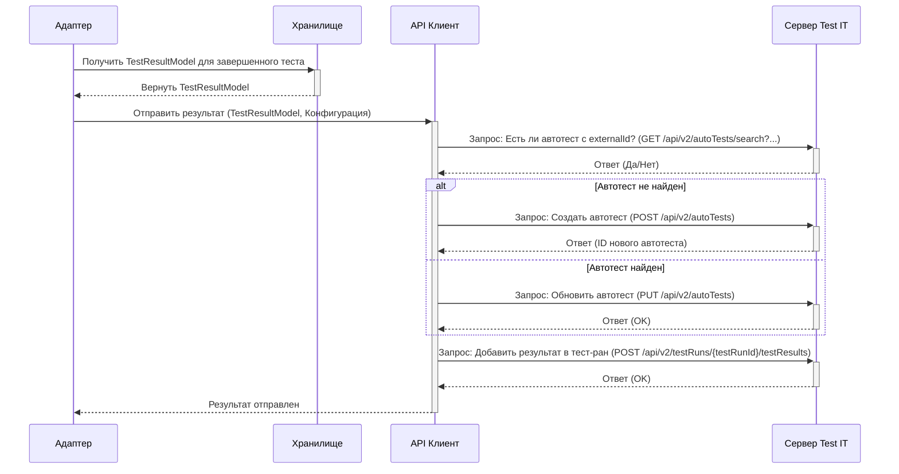

# Chapter 6: Взаимодействие с API Test IT


В [предыдущей главе](05_хранилище_и_модель_результата_теста_.md) мы узнали, как адаптер собирает всю информацию о тесте — его результат, шаги, вложения, ссылки — во временное хранилище, используя `TestResultModel`. Эта модель похожа на полностью заполненную "анкету" или готовое к отправке "письмо". Но как это "письмо" попадает по назначению, на сервер Test IT?

Вот тут и подключается наш последний ключевой компонент: **Взаимодействие с API Test IT**. Представьте себе почтовую службу. Она не пишет письма и не собирает посылки — этим занимались мы в предыдущих главах. Задача почтовой службы — взять готовое отправление (наш `TestResultModel`), проверить адрес и ключ доступа (из [Конфигурации](02_управление_конфигурацией_.md)) и надежно доставить его получателю (серверу Test IT).

Этот компонент — связующее звено между вашим локальным процессом тестирования и централизованной системой Test IT. Он отвечает за всю "сетевую магию": формирование HTTP-запросов, отправку данных, обработку ответов от сервера.

## Зачем это нужно? Доставка информации

Без этого компонента вся собранная информация о тестах так и осталась бы на вашем компьютере. Взаимодействие с API позволяет:

1.  **Отправлять результаты тестов:** Сообщать Test IT, какие тесты прошли успешно (`Passed`), какие упали (`Failed`), а какие были пропущены (`Skipped`).
2.  **Создавать или обновлять автотесты:** Если тест с определенным `externalId` запускается впервые, адаптер может автоматически создать соответствующий автотест в Test IT. Если он уже существует, адаптер обновит его информацию (например, шаги, описание).
3.  **Загружать вложения:** Когда вы используете `addAttachment` из главы [Функции обогащения результатов](04_функции_обогащения_результатов_.md), именно этот компонент отправляет файл на сервер Test IT.
4.  **Управлять тест-ранами:** В зависимости от настроек (`adapterMode` в [Конфигурации](02_управление_конфигурацией_.md)), адаптер может сам создавать новый тест-ран перед началом тестов или добавлять результаты в уже существующий.

По сути, это перевод внутренних данных адаптера (`TestResultModel`) на язык, понятный серверу Test IT (формат JSON для API-запросов), и отправка этих данных по сети.

## Как это работает: Почтовая служба в действии

Пользователь (то есть вы, разработчик тестов) обычно *не вызывает* функции этого компонента напрямую. Он работает автоматически "за кулисами". Вот основные моменты, когда он активируется:

*   **При запуске первого теста (если `adapterMode=2`):** Адаптер через API-компонент отправляет запрос на создание нового тест-рана в Test IT. Сервер возвращает ID этого рана, который сохраняется в конфигурации для последующих тестов.
*   **При вызове `addAttachment`:** API-компонент немедленно получает путь к файлу, формирует специальный HTTP-запрос (Multipart) и отправляет файл на сервер. Сервер возвращает ID загруженного файла, который сохраняется в `TestResultModel`.
*   **После завершения `tmsTest` / `tmsTestWidgets`:**
    1.  Адаптер извлекает готовый `TestResultModel` из [Хранилища](05_хранилище_и_модель_результата_теста_.md).
    2.  Он передает эту модель API-компоненту.
    3.  API-компонент проверяет, существует ли уже автотест с таким `externalId` в Test IT.
        *   Если нет, он отправляет запрос на *создание* автотеста (если включена опция `automaticCreationTestCases`).
        *   Если да, он отправляет запрос на *обновление* автотеста (чтобы синхронизировать шаги, описание и т.д.).
    4.  Затем API-компонент отправляет запрос на *добавление результата* этого теста (со статусом Passed/Failed, ссылками, сообщениями, ID вложений) в текущий тест-ран.
*   **После завершения всех тестов (если `adapterMode=2`):** Адаптер может отправить финальный запрос на "завершение" тест-рана в Test IT.

## Детальнее: Отправка одного результата теста

Давайте чуть подробнее рассмотрим, что происходит после завершения одного теста, обернутого в `tmsTest`:

1.  **Получение данных:** Адаптер получает полностью собранный `TestResultModel` из [Хранилища](05_хранилище_и_модель_результата_теста_.md).
2.  **Получение конфигурации:** Адаптер достает настройки из [Конфигурации](02_управление_конфигурацией_.md): URL сервера Test IT, Private Token, Project ID, Configuration ID, Test Run ID.
3.  **Проверка и обновление автотеста:**
    *   API-клиент делает запрос к Test IT: "Существует ли автотест с `externalId` = (значение из `TestResultModel`) в проекте (Project ID)?" (`getAutoTestByExternalIdAsync`).
    *   Если автотеста нет: API-клиент делает запрос: "Создай новый автотест с этими данными (`externalId`, шаги, описание и т.д.)" (`createAutoTestAsync`), если разрешено конфигурацией.
    *   Если автотест есть: API-клиент делает запрос: "Обнови существующий автотест вот этими данными" (`updateAutoTestAsync`).
4.  **(Опционально) Привязка к Work Items:** Если в `TestResultModel` указаны `workItemIds`, API-клиент проверяет и обновляет связи между автотестом и этими задачами в Test IT.
5.  **Отправка результата:** API-клиент делает финальный запрос: "Добавь вот этот результат (`TestResultModel` с Outcome, Attachments, Links и т.д.) для Configuration ID в Test Run ID" (`submitResultToTestRunAsync`).

Эта последовательность гарантирует, что в Test IT всегда будет актуальная информация об автотесте и его последний результат выполнения.

### Диаграмма взаимодействия при отправке результата



Эта диаграмма упрощенно показывает шаги, которые выполняет API-клиент для отправки одного результата.

## Заглянем "под капот": Код взаимодействия с API

Основная логика взаимодействия с API сосредоточена в нескольких файлах внутри `lib/src/service/api/` и управляется из `lib/src/manager/api_manager.dart`.

### Оркестратор: `api_manager.dart`

Этот файл координирует вызовы к различным частям API. Ключевая функция — `processTestResultAsync`, которая вызывается после завершения теста.

```dart
// Упрощенный пример из lib/src/manager/api_manager.dart

import 'package:adapters_flutter/src/service/api/autotest_api_service.dart';
// ... другие импорты ...

@internal
Future<void> processTestResultAsync(
    final ConfigModel config, final TestResultModel testResult) async {
  // 1. Пытаемся найти существующий автотест по externalId
  var autoTest =
      await getAutoTestByExternalIdAsync(config, testResult.externalId);

  if (autoTest == null) {
    // 2а. Если не найден, создаем новый (если разрешено)
    autoTest = await createAutoTestAsync(config, testResult);
  } else {
    // 2б. Если найден, обновляем его
    await updateAutoTestAsync(config, testResult);
  }

  // (Опционально: обновляем связи с Work Items)
  if (testResult.workItemIds.isNotEmpty) {
    await _tryUpdateWorkItemsLinkedToAutoTestAsync(
        autoTest?.id, config, testResult.workItemIds);
  }

  // 3. Отправляем результат этого теста в тест-ран
  await submitResultToTestRunAsync(config, testResult);
}
```

**Пояснение:**
*   Функция получает конфигурацию (`config`) и собранный результат теста (`testResult`).
*   Она последовательно вызывает функции из `autotest_api_service.dart` и `test_run_api_service.dart` для выполнения шагов, описанных ранее (найти/создать/обновить автотест, отправить результат).

### Сервисы API: `autotest_api_service.dart`, `attachment_api_service.dart`, `test_run_api_service.dart`

Эти файлы содержат функции для взаимодействия с конкретными "ручками" (endpoints) API Test IT.

**Пример: Создание автотеста (`autotest_api_service.dart`)**

```dart
// Упрощенный пример из lib/src/service/api/autotest_api_service.dart
import 'dart:convert';
import 'package:adapters_flutter/src/converter/test_result_converter.dart';
import 'package:adapters_flutter/src/util/http_util.dart';
// ...

@internal
Future<AutoTestFullModel?> createAutoTestAsync(
    final ConfigModel config, final TestResultModel testResult) async {
  AutoTestFullModel? autoTest;

  // Формируем заголовки запроса (включая токен авторизации)
  final headers = {
    'Content-Type': 'application/json',
    'Authorization': 'PrivateToken ${config.privateToken}'
  };
  // Формируем URL для API
  final url = '${config.url}/api/v2/autoTests';
  // Создаем объект запроса
  final request = Request('POST', Uri.parse(url));

  // Преобразуем TestResultModel в формат API с помощью конвертера
  final requestBody =
      toCreateAutoTestRequestModel(config.projectId, testResult);
  // Добавляем тело запроса (в формате JSON)
  request.body = json.encode(requestBody);
  request.headers.addAll(headers);

  // Отправляем запрос и получаем ответ (используя http_util)
  final response = await getOkResponseOrNullAsync(request);

  // Если ответ успешный, парсим его
  if (response != null) {
    autoTest = AutoTestFullModel.fromJson(
        jsonDecode(response.body) as Map<String, dynamic>);
  }

  return autoTest; // Возвращаем созданный автотест (или null)
}
```

**Пояснение:**
*   Функция подготавливает HTTP POST-запрос: URL, заголовки, тело запроса.
*   Важно: она использует `toCreateAutoTestRequestModel` (из `lib/src/converter/test_result_converter.dart`) для преобразования нашего внутреннего `TestResultModel` в формат JSON, который ожидает API Test IT.
*   Она использует `getOkResponseOrNullAsync` из `http_util.dart` для отправки запроса и базовой обработки ответа.
*   Аналогично устроены функции `updateAutoTestAsync`, `submitResultToTestRunAsync` и другие — они формируют нужный запрос (GET, POST, PUT, DELETE) к соответствующему URL API Test IT.

**Пример: Загрузка вложения (`attachment_api_service.dart`)**

```dart
// Упрощенный пример из lib/src/service/api/attachment_api_service.dart
import 'package:http/http.dart';
import 'package:http_parser/http_parser.dart';
// ...

@internal
Future<AttachmentResponseModel?> createAttachmentAsync(
    final ConfigModel config, final File file) async {
  AttachmentResponseModel? attachment;

  final headers = {
    'Authorization': 'PrivateToken ${config.privateToken}'
    // Content-Type здесь не нужен, т.к. это Multipart
  };
  final url = '${config.url}/api/v2/attachments';
  // Создаем Multipart-запрос (специальный тип для файлов)
  final request = MultipartRequest('POST', Uri.parse(url));

  // Читаем файл и подготавливаем его для отправки
  final fileBytes = await file.readAsBytes();
  final fileName = basename(file.path); // Получаем имя файла
  final multipartFile = MultipartFile.fromBytes('file', fileBytes,
      contentType: MediaType.parse(
          lookupMimeType(fileName) ?? 'application/octet-stream'), // Определяем тип файла
      filename: fileName);
  request.files.add(multipartFile); // Добавляем файл в запрос
  request.headers.addAll(headers);

  // Отправляем запрос
  final response = await getOkResponseOrNullAsync(request);

  // Парсим ответ, чтобы получить ID загруженного файла
  if (response != null) {
    attachment = AttachmentResponseModel.fromJson(
        jsonDecode(response.body) as Map<String, dynamic>);
  }

  return attachment; // Возвращаем ID (или null)
}
```

**Пояснение:**
*   Эта функция отличается тем, что использует `MultipartRequest` для отправки содержимого файла.
*   Она определяет MIME-тип файла (например, `image/png`, `text/plain`), чтобы сервер правильно его обработал.
*   В остальном логика похожа: подготовка запроса, отправка, обработка ответа.

### HTTP Утилита: `http_util.dart`

Этот файл содержит вспомогательную функцию для отправки HTTP-запросов и проверки базового статуса ответа (успешный код 2xx или нет).

```dart
// Упрощенный пример из lib/src/util/http_util.dart
import 'package:http/http.dart';
import 'package:logger/logger.dart';
// ...

final Logger _logger = getLogger(); // Логгер для записи ошибок

@internal
Future<Response?> getOkResponseOrNullAsync(final BaseRequest request) async {
  Response? response;

  try {
    // Отправляем подготовленный запрос (любого типа)
    final streamedResponse = await request.send();
    // Получаем полный ответ
    response = await Response.fromStream(streamedResponse);

    // Проверяем HTTP статус код
    if (response.statusCode < 200 || response.statusCode > 299) {
      // Если код не 2xx (неуспешный), логируем ошибку и обнуляем ответ
      final message =
          'Status code: ${response.statusCode}, Reason: "${response.reasonPhrase}".';
      _logger.i('API Error: $message.'); // Запись в лог
      response = null; // Считаем ответ неуспешным
    }
  } catch (exception, stacktrace) {
    // Ловим и логируем любые другие ошибки сети или парсинга
    _logger.i('Network or parsing error: $exception\n$stacktrace.');
    response = null; // Считаем ответ неуспешным
  }

  // Возвращаем успешный ответ или null в случае ошибки
  return response;
}
```

**Пояснение:**
*   Эта функция инкапсулирует общую логику отправки запроса и базовой проверки ответа (успешный HTTP статус).
*   Она используется всеми сервисами (`autotest_api_service`, `attachment_api_service` и т.д.) для выполнения реальных сетевых вызовов.

## Заключение

В этой главе мы рассмотрели последний важный компонент `adapters-flutter` — механизм взаимодействия с API Test IT. Мы узнали, что он действует как "почтовая служба", отвечая за отправку собранных данных о тестах (из [Хранилища](05_хранилище_и_модель_результата_теста_.md)), используя адрес и ключ из [Конфигурации](02_управление_конфигурацией_.md). Мы увидели, какие основные задачи он решает (отправка результатов, создание/обновление автотестов, загрузка вложений, управление тест-ранами) и как он работает "под капотом", вызывая соответствующие функции API Test IT через HTTP-запросы.

Мы прошли путь от базовой интеграции тестов с помощью `tmsTest` и `tmsTestWidgets`, через настройку адаптера, добавление шагов и обогащение результатов, к пониманию того, как данные собираются и, наконец, отправляются в Test IT. Теперь у вас есть полное представление о том, как `adapters-flutter` помогает автоматизировать отчетность по вашим Flutter-тестам!

На этом основная часть нашего руководства завершена. Для получения более подробной информации о всех параметрах конфигурации, продвинутых сценариях использования и полного справочника по API, пожалуйста, обратитесь к файлу README основного репозитория проекта `adapters-flutter`. Успешного тестирования!

---

Generated by [AI Codebase Knowledge Builder](https://github.com/The-Pocket/Tutorial-Codebase-Knowledge)